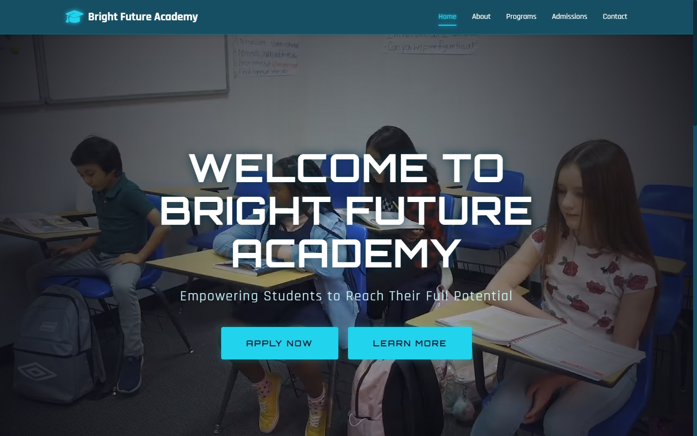
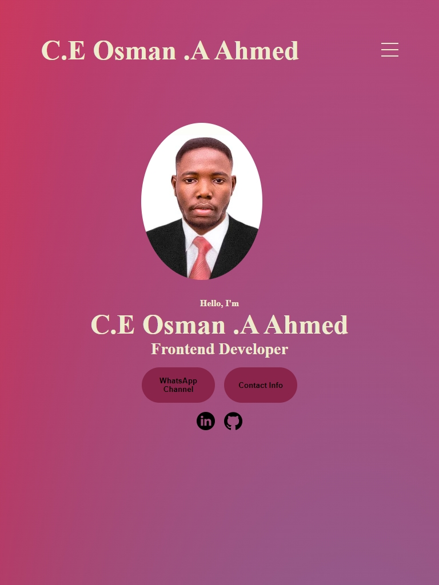

# 🏫 School Website — Developed by C.E. Osman A. Ahmed

A clean, modern, and responsive **School Landing Page** website built using HTML, CSS, and JavaScript.  
This site serves as an educational institution’s front-facing website, showcasing information about the school, programs, admissions, and contact details. :contentReference[oaicite:0]{index=0}

---

## 📸 Screenshots

### 🏠 Homepage

### 🎬 Portfolio Section

## 🚀 Features

- 📱 **Responsive & Mobile-Friendly UI**
- 🏫 Sections for *About*, *Programs*, *Admissions*, and *Contact*
- 🎨 Clean modern design suitable for school branding
- 🧩 Easy to update and expand for more pages
- ⚡ Optimized with standard HTML, CSS, and JS

---

## 🛠 Built With

- **HTML5** — Markup and structure  
- **CSS3** — Styling and layout  
- **JavaScript** — Optional interactive components

No frameworks or build tools required.

---

## 📁 Project Structure
School-Website-Dev-By-C.E-Osman-.A-Ahmed/
├── assets/ # Images, icons, media
├── css/ # Stylesheets
├── js/ # JavaScript files
├── screenshots/ # Preview images for README
├── index.html # Homepage
├── about.html # About School
├── programs.html # Programs & Courses
├── admissions.html # Admissions info
├── contact.html # Contact page
└── README.md # Documentation
